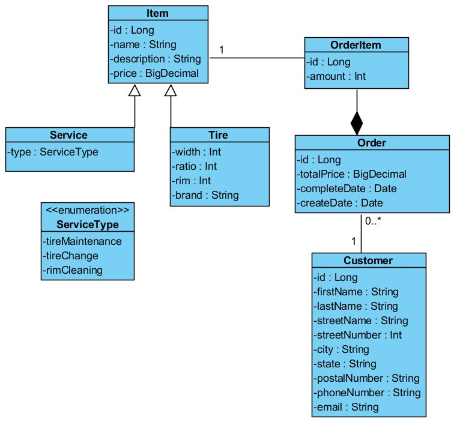

# PA165_pneuservis  
EN: Git repository for team project - pneuservis for course PA165 / 2015  
SK: Git repozitár pre teamový projekt - pneuservis pre predmet PA165 / 2015  

##Oficiální zadání:  
Vytvořte systém, ve kterém si bude moci zákazník vybrat nové obutí pro svoje vozidlo z nabídky pneuservisu. Pneuservis bude poskytovat různé typy pneumatik, velikosti, od různých výrobců, s různou cenou. Výběr zákazníka bude zaznamenán a evidován pod jeho jménem, adresou, telefonem a typem vozidla, které chce přezout. Kromě přezouvání bude pneuservis poskytovat i nějaké doprovodné služby, jakými může být kontrola sbíhavosti kol apod. Ty si může zákazník přiobjednat k přezutí kol. Jeden zákazník si může vytvořit více objednávek. Systém také bude schopný poskytnout přehled všech objednávek dle zákazníků, celkovou cenu obejdnávky apod.

###Teamový kolegovia:  
448288 - Komárek, Ondřej  
436321 - Mészáros, Filip  
374029 - Šumaj, Jozef  
436353 - Holý, Jakub  

###Detaily:  
Zákazník je schopný si cez webovú službu vybrať a následne objednať pneumatiky pre svoje vozidlo, prípadne službu pre svoje vozidlo, ako napríklad kontrolu zbiehania pneumatík, atď. Po zvolení daných produktov a služieb o ktoré má zákazník záujem sa zákazníkovi objaví ponuka pre vyplnenie osobných údajov. Po vyplnení osobných údajov má zákazník možnosť odoslať objednávku pneuservisu. Pracovník v pneuservise na základe aktuálnych objednávok zavolá zákazníkovi a dohodne s ním, kedy sa zákazník ukáže aj s vozidlom v pneuservise. Zamestnanec pneuservisu môže každú objednávku zmeniť priamo v systéme. Platby prevádza zákazník zamestnancovi priamo pri osobnej návšteve pneuservisu. O vybavenie a uzatváranie objednávok sa stará priamo zamestnanec pneuservisu pri osobnej návšteve pneuservisu zákazníkom. 

###Use Case Diagram:

  

###Class Diagram: 

##Project requirements

###Milestone 2 requirements:  
- [x] Implement Facade layer interfaces and implementations.
   - [ ] Everything that should happen in the system must be available through these interfaces (create entities, deleting them etc).
   - [ ] You must have at least 2 non-trivial business functions on Service Layer (the example project contains several of them). Service layer is not always just a place to delegate to DAO.
- [ ] Other points about the Facade and Service layers:
   - [ ] All the classes must be wired via dependency injection. Your service objects should obtain an instance of the EntityManager that way.
   - [ ] All the facade interfaces must not reference entities, but Transfer Objects only.
   - [ ] All service interfaces must reference only entities, not Data Transfer Objects.
   - [ ] You can use Dozer framework to map entity instances to transfer objects. The mapping may be done on Facade Layer.
   - [ ] Facade layer is used to drive transactions.
- [x] Change layout of your project to Multimodule Maven project (tutorial here http://maven.apache.org/guides/getting-started/index.html). Your project should have 3 separate modules:
   - DAO layer
   - Service Layer and Facade Layer implementation
   - API layer - just DTOs and facade interfaces!
- [x] Facade layer will use Service layer and Service layer will use DAO layer.
- [x] Make sure that DataAccessException or its subclass is thrown in case of any exception on a the DAO layer.
- [x] Implement simple unit tests for facade layer. Just one simple test per method is enough. This is mainly so that it’s easy to verify the Facade layer works.
- [x] There must be extensive unit tests for the service layer (particularly for your 2 business functions) and all the tests of service layer must use Mock DAO objects.
- [ ] Evaluate another team project.

###Milestone 1 requirements:  
- [x] Create a project in a Github repository that is publicly accessible (for read) choose a short and descriptive name. Create some project wiki to publish other information for your project.
- [x] On the project wiki there will be a project description, a use case diagram and a class diagram for entity classes. There will be at least two user roles in the use case diagram. Associations between entities will be present in the class diagram.  
- [x] Create 4 entity classes for your project.
- [x] Create a DAO layer interface (with proper javadoc).
- [x] Create the JPA implementation of the DAO classes (CRUD operations are enough for the first checkpoint).
- [x] Create unit tests for DAO classes (use in-memory database).
- [x] Every team member should work with different entities on different parts of the project (e.g. member 1 will create implementation of DAO for entity A, but member 2 will create unit test for entity A). In every class there will  be javadoc @author with the name of the class author. Also you must commit into Git only the changes that you made yourself. If you commit on behalf of somebody else this will not be regarded as his work!
- [x] The project will be built using maven, and make sure you have all dependencies correctly configured, so it is possible to build it using just the command line.
- [x] Evaluate another team project.

Points:
7 points gained from milestone 1 out of total 10 points
-3 points was for: Java konfigurace Springu byla jedna ku jedné zkopírována z ukázkového projektu. Jak jsem již několikrát zmiňoval, toto je neakceptovatelné. 

